## Contexte

- Production accrue de plastiques depuis les années 1950
- Pollution marine majeure : 4-12 millions de tonnes de plastique/an   
- Danger pour la faune et les écosystèmes marins

::: {layout-ncol=2}
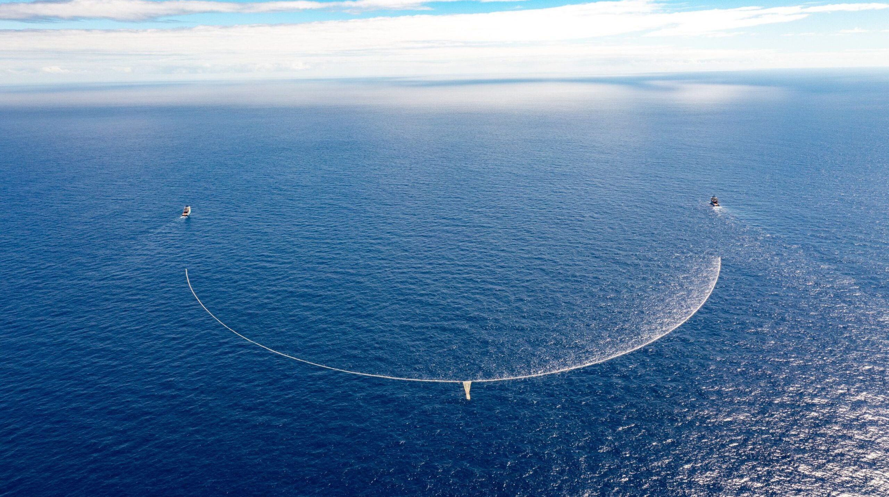

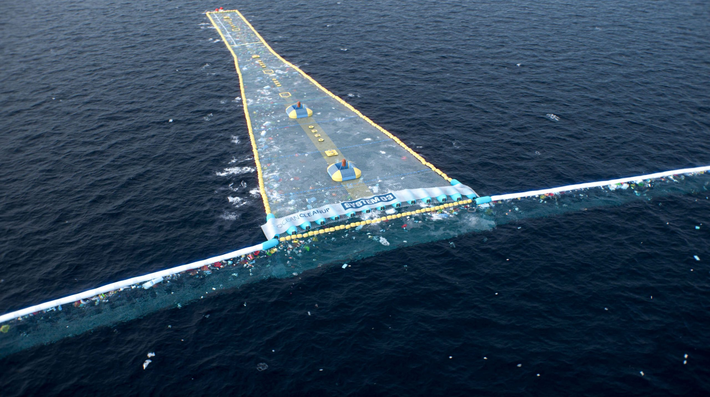
:::
```{=html}
<div style="text-align: center; font-size: 0.7em;">
Source : The Ocean Cleanup
</div>
```

---

## Objectifs

<!-- Objectif final --> 
- Prédire le mouvement et la dispersion des plastiques dans les océans
<!-- Pour atteindre cet objectif on a besoin de ... --> 
- Modéliser la dynamique des plastiques à l'aide de simulations numériques
- Comprendre la dynamique des plastiques en interaction avec les vagues (Dérive de Stokes)
- Visualisation de la dérive de Stokes pour des particules sans masse (suivent les lignes de courant) :


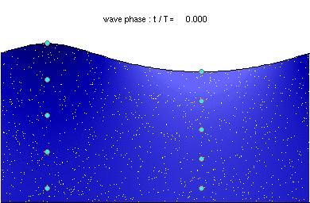{fig-align="center" width="800px" height="450px" style="object-fit: cover; border-radius: 10px;"}

<div style="text-align: center; font-size: 0.7em;">
By <a href="//commons.wikimedia.org/wiki/User:Kraaiennest" title="User:Kraaiennest">Kraaiennest</a> - <span class="int-own-work" lang="en">Own work</span>, <a href="https://creativecommons.org/licenses/by-sa/4.0" title="Creative Commons Attribution-Share Alike 4.0">CC BY-SA 4.0</a>, <a href="https://commons.wikimedia.org/w/index.php?curid=3374567">Link</a>
</div>

## Découpage du problème

- On découpe le problème en trois étapes :

```{=html}
<div style="display: flex; gap: 1.5rem; align-items: flex-start;">
  <div style="flex: 1; text-align: center;">
    <video autoplay loop muted playsinline width="50%">
      <source src="videos/solide.mp4" type="video/mp4">
    </video>
    <p style="font-size: 0.9em;">Solide seul</p>
  </div>
  <div style="flex: 1; text-align: center;">
    <video autoplay loop muted playsinline width="50%">
      <source src="videos/cylindre_2.mp4" type="video/mp4">
    </video>
    <p style="font-size: 0.9em;">Ajout d'une interface plane</p>
  </div>
  <div style="flex: 1; text-align: center;">
    <video autoplay loop muted playsinline width="50%">
      <source src="videos/vague3emeordre.mp4" type="video/mp4">
    </video>
    <p style="font-size: 0.9em;">Ajout d'une vague de Stokes</p>
  </div>
</div>
```


## Equations régissant la dynamique du problème 
- Dans le domaine $\Omega_{\text{tot}}= \Omega_f \cup \Omega_p$, on résout les équations de Navier-Stokes incompressible, tout en imposant un mouvement de **corps rigide** dans la **région occupée par le solide** $\Omega_p$.
$$
\nabla\cdot \mathbf{u} =0 \quad \forall \mathbf{x} \in \Omega_{\text{tot}}$$
$$
{\color{red}{\rho_{\text{eff}}}} \left( \frac{\partial \mathbf{u}}{\partial t} + \mathbf{u} \cdot \nabla \mathbf{u} \right) = -\nabla p + \nabla \cdot \left[ {\color{red}{\mu_{\text{eff}}}} (\nabla \mathbf{u} + \left(\nabla \mathbf{u}\right)^T) \right] + {\color{red}{\rho_{\text{eff}}}} \mathbf{g} \quad \forall \mathbf{x} \in \Omega_{\text{tot}}
$$
$$
\mathbf{u} = \mathbf{U} + \boldsymbol{\omega} \times \mathbf{OM} \quad \forall \mathbf{x} \in \Omega_p
$$

- On advecte une fonction de couleur $C_1$ pour suivre la **surface libre air/eau**, et une fonction de couleur $C_2$ pour suivre la position du solide.

$$ \frac{\partial C_1}{\partial t} + \nabla \cdot (C_1 \mathbf{u}) = 0 \qquad \frac{\partial C_2}{\partial t} + \nabla \cdot (C_2 \mathbf{u}) = 0
$$


## Modélisation des phases 

- On utilise une formulation dite **1 fluide** pour modéliser les différentes phases.

- On introduit deux fonctions de couleur $C_1$ et $C_2$ :

::: {.text-center}
$$
C_1 = 
  \begin{cases}
 1 & \text{dans l'eau} \\
 0 & \text{ailleurs}
  \end{cases} 
\qquad \text{et}\qquad
C_2 = 
  \begin{cases}
 1 & \text{dans le solide} \\
 0 & \text{ailleurs}
 \end{cases}
$$
:::

- Les propriétés physiques sont alors définies comme des fonctions de ces variables de phase :

::: {.text-center}
$${\color{red}{\rho_{\text{eff}}}} = (1-C_1-C_2)\rho_{\text{air}} + C_1 \rho_{\text{eau}} + C_2 \rho_{\text{solide}}$$
$${\color{red}{\mu_{\text{eff}}}} = (1-C_1-C_2)\mu_{\text{air}} + C_1 \mu_{\text{eau}} + C_2 \mu_{\text{solide}}$$
:::

:::: {.columns}

::: {.column width="33%"}
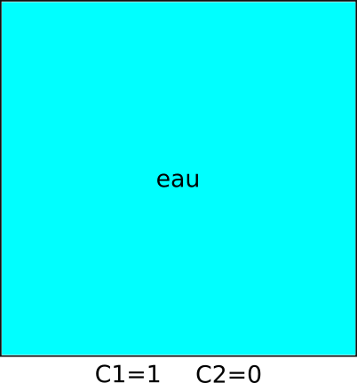{height=250px fig-align="center"}

:::

::: {.column width="33%"}
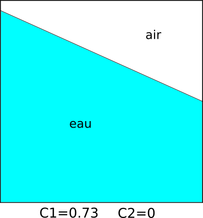{height=250px fig-align="center"}

:::

::: {.column width="33%"}
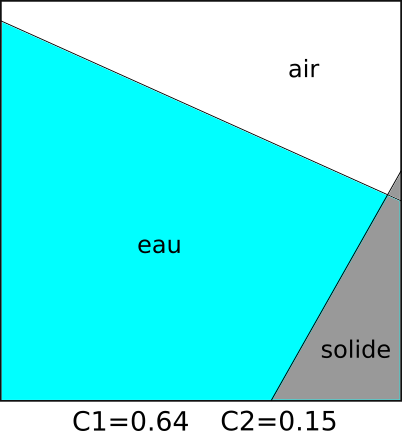{height=250px fig-align="center"}

:::

::::


## Mouvement de corps rigide : pénalisation tensorielle

- **Idée** : imposer un mouvement de **corps rigide** dans la région occupée par le solide où $C_2=1$ et $C_1=0$.

$$
{\color{red}{\rho_{\text{solide}}}} \left( \frac{\partial \mathbf{u}}{\partial t} + \mathbf{u} \cdot \nabla \mathbf{u} \right) = -\nabla p + \nabla \cdot \left[ {\color{red}{\mu_{\text{solide}}}} (\nabla \mathbf{u} + (\nabla \mathbf{u})^T) \right] + {\color{red}{\rho_{\text{solide}}}} \mathbf{g}
$$

- Si on fait tendre la viscosité du solide vers l'infini ($\mu_{\text{solide}} \to \infty$), cela revient à résoudre dans le solide :

$$\nabla \cdot [{\color{red}{\mu_{\text{solide}}}} (\nabla \mathbf{u} + \left(\nabla \mathbf{u}\right)^T)]=0$$

- On peut montrer que c'est équivalent à imposer ( @patankar2000, @sharma2005) : 

$$
{\color{red}{\mu_{\text{solide}}}} (\nabla \mathbf{u} + (\nabla \mathbf{u})^T) = \mathbf{0}
$$

- Ce qui est équivalent à imposer un mouvement de corps rigide (@CALTAGIRONE2001607, @vincent2007) :

$$
\mathbf{u} = \mathbf{U} + \boldsymbol{\omega} \times \mathbf{OM} 
$$


## Cas d'étude  

:::: {.columns}
::: {.column width="33%"}
**Cas 1** : Ascension d'un cylindre initialement immergé dans de l'eau.
:::

::: {.column width="33%"}
**Cas 2** : Ascension d'un cylindre initialement immergé dans de l'eau, en présence d'une **interface libre plane**.
:::

::: {.column width="33%"}
**Cas 3** : Ascension d'un cylindre initialement immergé dans de l'eau, en présence d’une **vague de Stokes** à l'interface.
:::
::::

:::: {.columns}
::: {.column width="33%"} 
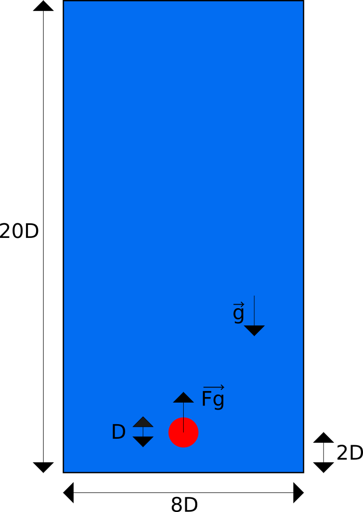{fig-align="center" height="600px"}
:::

::: {.column width="33%"}
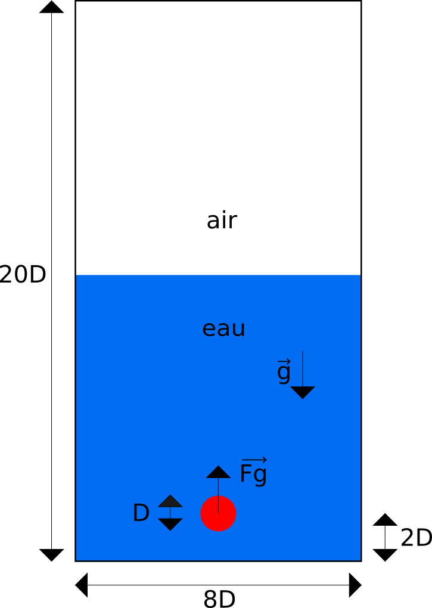{fig-align="center" height="600px"}
:::

::: {.column width="33%"}
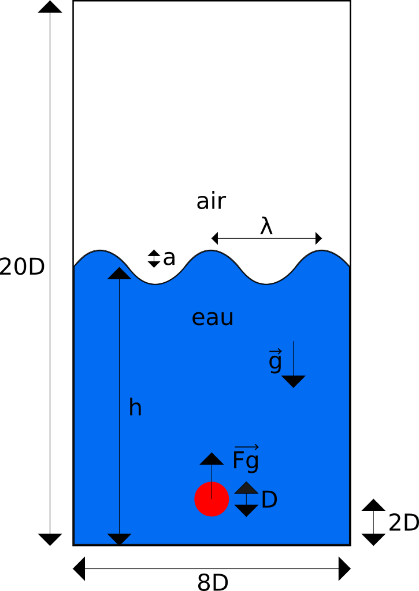{fig-align="center" height="600px"}
:::
::::

## Etude du cas 1 : cylindre seul dans un fluide

:::: {.columns}
::: {.column width="50%"}
**Cas 1** : Ascension d'un cylindre (Objet STL) initialement immergé.
:::

::: {.column width="50%"}
<div style="text-align: center;">
**Nombres adimensionnels du problème** :
</div>
:::
::::

:::: {.columns}
::: {.column width="33%"}
{fig-align="center" height="500px"}
:::

::: {.column width="33%"}
```{=html}
<div style="flex: 1; text-align: center;">
    <video autoplay loop muted playsinline style="width: 100%; max-width: 225px;">
      <source src="videos/solide.mp4" type="video/mp4">
    </video>
</div>
```
:::

::: {.column width="33%"}
$$\color{red}{
\Pi_1 = \frac{\rho_{\text{solide}}}{\rho_{\text{eau}}}=m}
$$
$$\color{red}{
\Pi_2=\frac{U}{\sqrt{Dg}}=F_r}
$$
$$\color{red}{
\Pi_3=\frac{\sqrt{(1-m)gD^3}}{\nu_f}=G_a}
$$
:::
::::
<div style="text-align: center; font-size: 0.9em;">
**Simulation pour $m=0.8, G_a=16$**
</div>

@article


## Etude de convergence de maillage

| Maillage | $N_x$ | $N_y$ | $\Delta x = \Delta y$ | Mailles / diamètre |
|:---:|:---:|:---:|:---:|:---:|
| 1 | 48  | 120  | 0.167   | 6 |
| 2 | 96 | 240  | 0.083   | 12 |
| 3 | 192 | 480  | 0.042  | 24 |

: Caractéristiques des différents maillages testés {#tbl-mesh_properties}

```{=html}
<div style="display: flex; justify-content: center; gap: 20px;">
  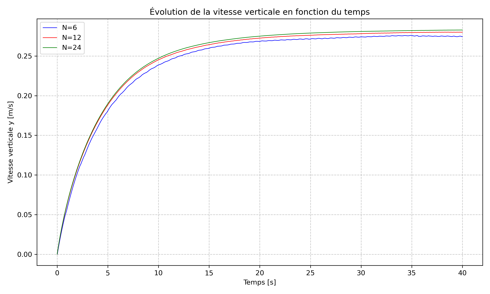
  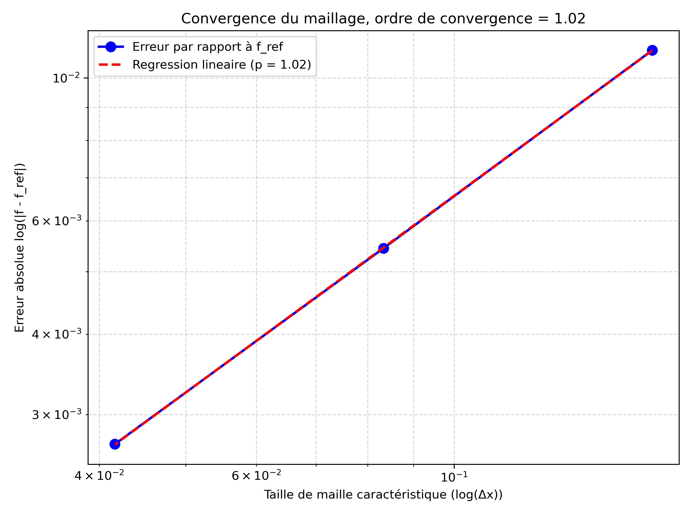
</div>
```

## Etude du cas 2 : ajout d'une interface libre plane

:::: {.columns}
::: {.column width="50%"}
**Cas 2** : Laché d'un cylindre ayant initialement une partie immergée   dans de l'eau, en présence d'une **interface libre plane**.
:::
::: {.column width="50%"}
<div style="text-align: center;">
**Nombres adimensionnels du problème** :
</div>
:::
::::

:::: {.columns}
::: {.column width="50%"}
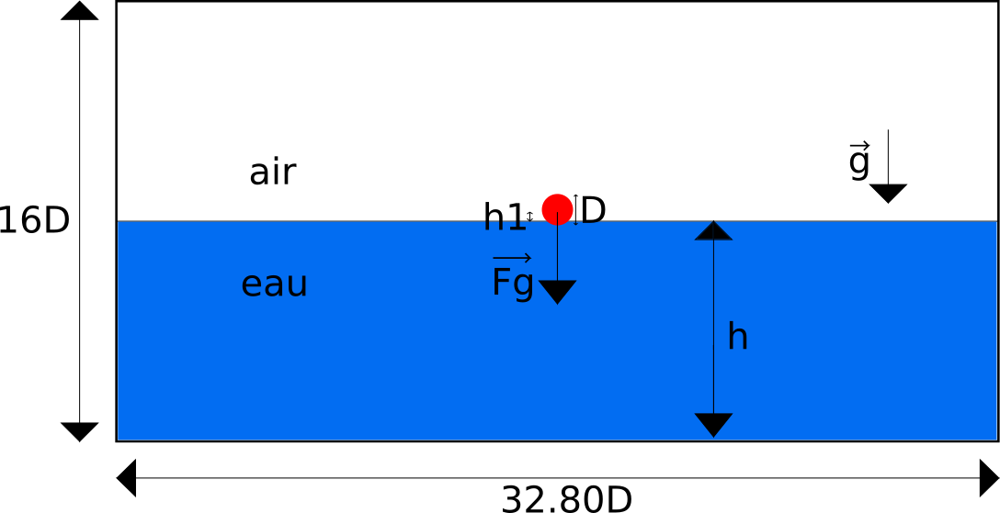{fig-align="center"}
{fig-align="center"}
:::
::: {.column width="50%"}
$$\color{red}{
\Pi_1 = \frac{\rho_{\text{solide}}}{\rho_{\text{eau}}}=m}
$$
$$\color{red}{
\Pi_2=\frac{U}{\sqrt{Dg}}=F_r}
$$
$$\color{red}{
\Pi_3=\frac{\sqrt{(1-m)gD^3}}{\nu_f}=G_a}
$$
$$\color{blue}{
\Pi_4=\frac{D}{h}}
$$

$$
m=0.5 \qquad h=1.22 \text{ m }
$$

$$
\text{variable d'intérêt : } \frac{z-d}{h1}
$$

:::
::::

## Etude paramétrique du problème

Etude de l'influence de différents paramètres (longueur du domaine de calcul, résidu imposé à atteindre pour chaque itération, viscosité pénalisante $\mu_{\text{solide}}$, maillage, pas de temps) sur la trajectoire du cylindre.

:::: {.columns}
::: {.column width="50%"}
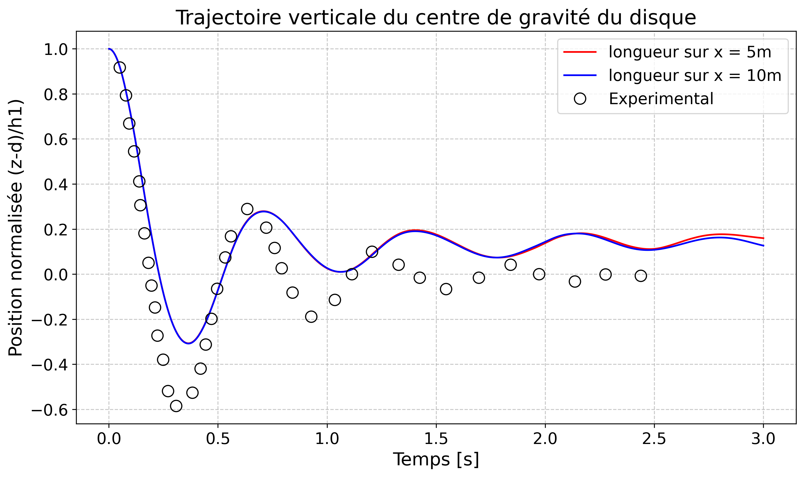{fig-align="center" height="400px"}
:::
::: {.column width="50%"}
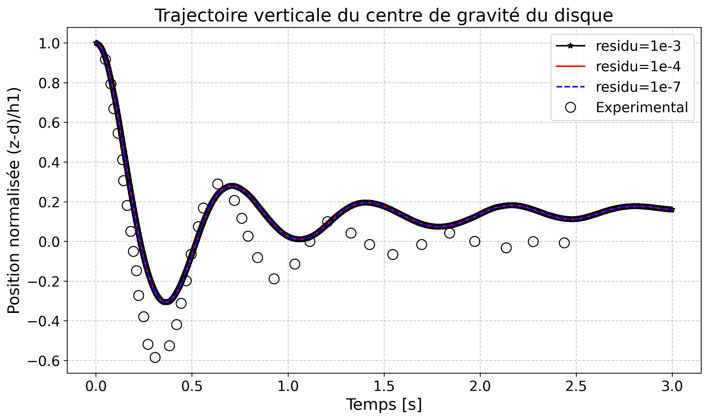{fig-align="center" height="400px"}
:::
::::

:::: {.columns}
::: {.column width="50%"}
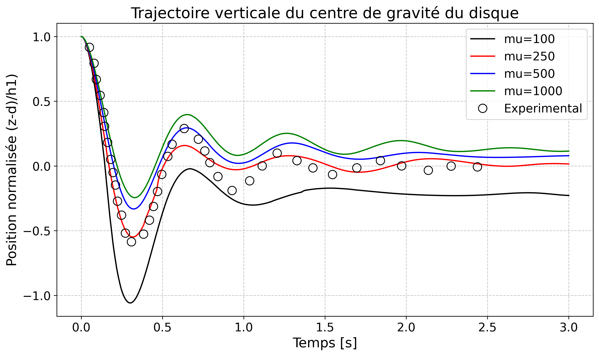{fig-align="center" height="400px"}
:::
::: {.column width="50%"}
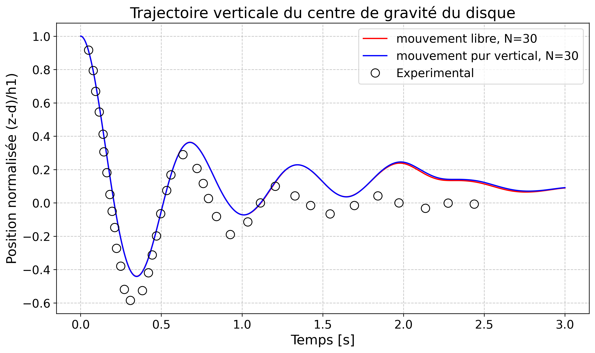{fig-align="center" height="400px"}
:::
::::

## Etude paramétrique du problème

Etude effectuée pour  $\mu_{\text{solide}}=1000 kg.m^{-1}.s^{-1}$, un résidu à atteindre = 10$^{-3}$, une longueur du domaine de calcul de 5m. 

:::: {.columns}
::: {.column width="50%"}
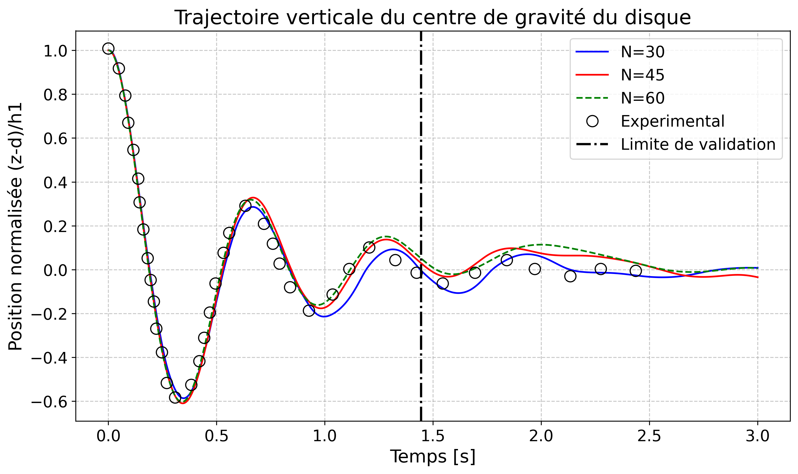{fig-align="center" height="400px"}
:::
::: {.column width="50%"}
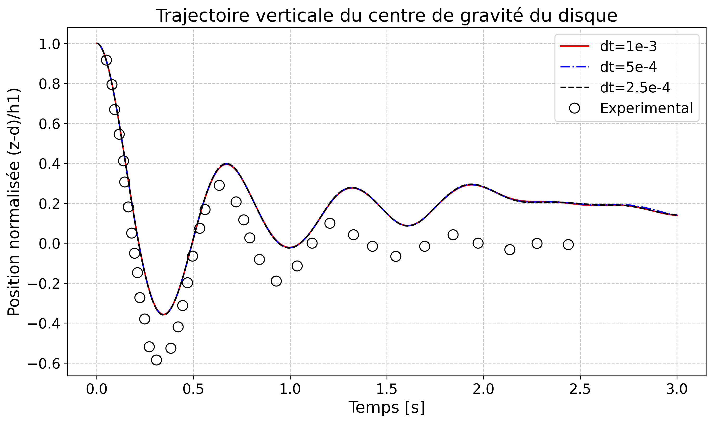{fig-align="center" height="400px"}
:::
:::: 

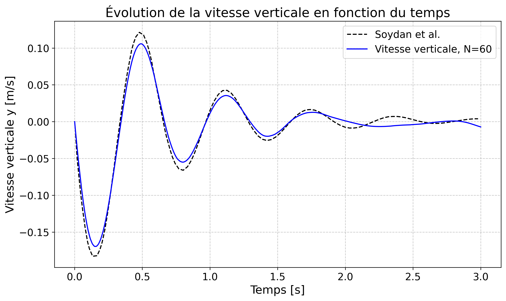{fig-align="center" height="400px"}


## Etude de convergence de maillage (suite)

Etude effectuée avec comme solution de référence un résultat analytique simplifié (@Maskell_Ursell_1970). 

On définit notre erreur comme : $$\alpha = \vert\frac{y_{\text{ref}}-y_{\text{num}}}{y_{\text{ref}}}\vert$$

Et la norme $L_p$ de l'erreur $\alpha$ : $$\Vert \alpha \Vert_p = \left( \int_0^1 \alpha (t)^p\,dt \right)^{\frac{1}{p}}$$


:::: {.columns}
::: {.column width="33%"}
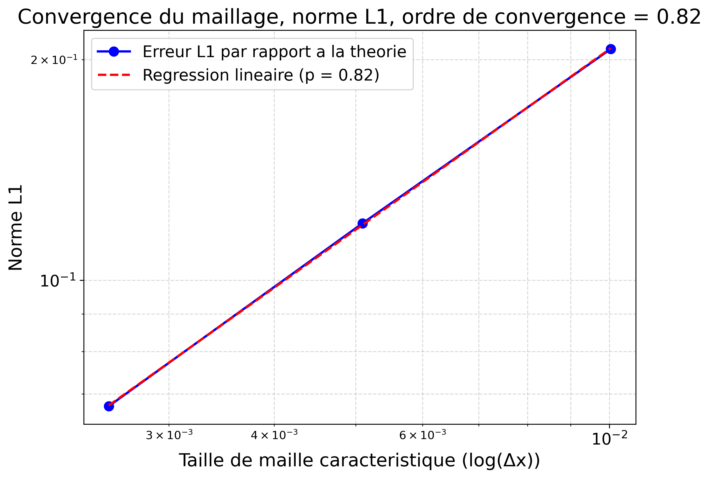{fig-align="center" width="100%"}
:::
::: {.column width="33%"}
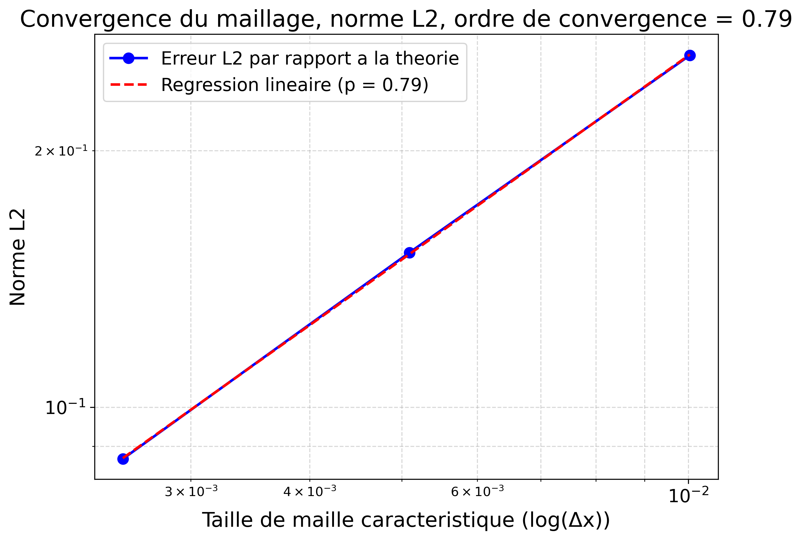{fig-align="center" width="100%"}
:::
::: {.column width="33%"}
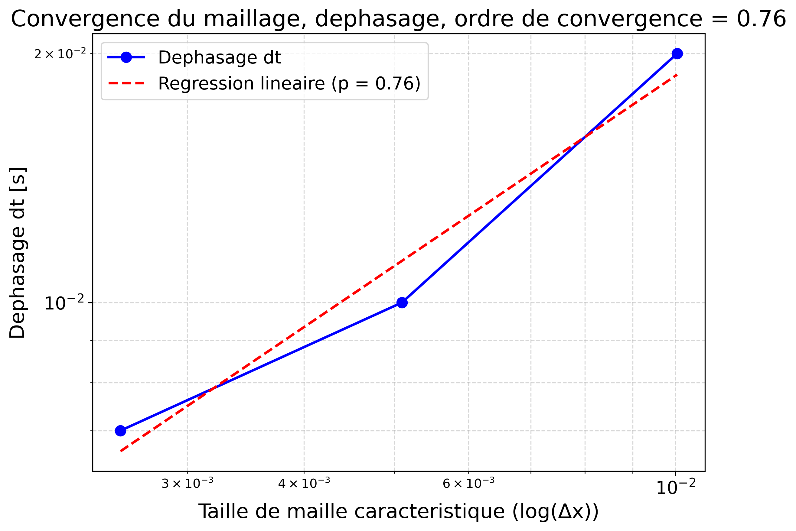{fig-align="center" width="100%"}
:::
::::


## Influence de la viscosité pénalisante $\mu_{\text{solide}}$

```{=html}
<div style="display: flex; gap: 1.5rem; align-items: flex-start;">
  <div style="flex: 1; text-align: center;">
    <video autoplay loop muted playsinline width="55%">
      <source src="videos/interface_100.mp4" type="video/mp4">
    </video>
    <p style="font-size: 0.9em;">μ<sub>solide</sub> = 100</p>
  </div>
  <div style="flex: 1; text-align: center;">
    <video autoplay loop muted playsinline width="55%">
      <source src="videos/interface_200.mp4" type="video/mp4">
    </video>
    <p style="font-size: 0.9em;">μ<sub>solide</sub> = 200</p>
  </div>
  <div style="flex: 1; text-align: center;">
    <video autoplay loop muted playsinline width="55%">
      <source src="videos/interface_300.mp4" type="video/mp4">
    </video>
    <p style="font-size: 0.9em;">μ<sub>solide</sub> = 300</p>
  </div>
</div>
```

## Etude du cas 3 : ajout d'une vague de Stokes

:::: {.columns}
::: {.column width="50%"}
**Cas 3** : Ascension d'un cylindre initialement immergé dans de l'eau, en présence d'une **vague de Stokes** à l'interface.
:::
::: {.column width="50%"}
<div style="text-align: center;">
**Nombres adimensionnels du problème** :
</div>
:::
::::

:::: {.columns}
::: {.column width="50%"}
{fig-align="center" height="600px"}
:::
::: {.column width="50%"}
$$\color{red}{
\Pi_1 = \frac{\rho_{\text{solide}}}{\rho_{\text{eau}}}=m \\
\Pi_2=\frac{U}{\sqrt{Dg}}=F_r \\
\Pi_3=\frac{\sqrt{(1-m)gD^3}}{\nu_f}=G_a} \\
\color{blue}{\Pi_4=\frac{D}{h}} \color{green}{\quad \Pi_5=\dfrac{D}{\lambda}}
$$
$$\color{green}{
\Pi_6=\dfrac{c}{\sqrt{Dg}} \quad \Pi_7=\dfrac{D}{a}
}$$
:::
::::

## Résultats préliminaires 

```{=html}
<div style="display: flex; gap: 0.1rem; justify-content: center; align-items: flex-start;">

  <div style="flex: 1; text-align: center;">
    <video autoplay loop muted playsinline style="width: 100%; max-width: 325px;">
      <source src="videos/vague_100.mp4" type="video/mp4">
    </video>
    <p style="font-size: 0.9em;">μ<sub>solide</sub> = 100</p>
  </div>

  <div style="flex: 1; text-align: center;">
    <video autoplay loop muted playsinline style="width: 100%; max-width: 325px;">
      <source src="videos/vague_solide.mp4" type="video/mp4">
    </video>
    <p style="font-size: 0.9em;">μ<sub>solide</sub> = 1000</p>
  </div>

</div>
```

## Bilan provisoire

- Mouvement de corps rigide via la pénalisation tensorielle : simulation triphasique de la dynamique d'une particule.

- Possibilité de simuler la dynamique d'objets de formes complexes (STL).

- Quels sont les nombres adimensionnels pertinents pour la dynamique d'un plastique dans un océan ?

- Etude numérique à approfondir sur la valeur de $\mu_{\text{solide}}$ à imposer ($\mu_{\text{solide}} \to \infty$).

- Vague qui se brise alors que l'on s'attend à une vague de Stokes non brisée (transparent suivant).


## Initialisation de la vague de Stokes

- Nous utilisons la formulation de la vague de Stokes du **second ordre** pour une **profondeur $h$** quelconque : 
$$
    \eta(x,t) = a \left\{ \cos \theta + ka \frac{3 - \sigma^2}{4 \sigma^3} \cos 2\theta \right\} + \mathcal{O} \left( (ka)^3 \right)
$$
$$
    \Phi(x, z, t) = a \frac{\omega}{k} \frac{1}{\sinh kh} \left\{ \cosh k(z + h) \sin \theta + ka \frac{3 \cosh 2k(z + h)}{8 \sinh^3 kh} \sin 2\theta \right\} - (ka)^2 \frac{1}{2 \sinh 2kh} \frac{gt}{k} + \mathcal{O} \left( (ka)^3 \right)
$$

:::: {.columns}
::: {.column width="50%"}
$$
    c = \frac{\omega}{k} = \sqrt{\frac{g}{k} \sigma} + \mathcal{O} \left( (ka)^2 \right)
$$
$$
    \sigma = \tanh kh 
$$
$$
    \theta(x,t) = kx - \omega t
$$
:::
::: {.column width="50%"}
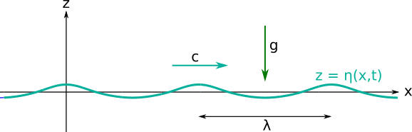{fig-align="center" width="100%"style="object-fit: cover; border-radius: 10px;"}
:::
::::

(-@dingemans1997, By <a href="//commons.wikimedia.org/wiki/User:Kraaiennest" title="User:Kraaiennest">Kraaiennest</a> - <span class="int-own-work" lang="en">Own work</span>, <a href="https://creativecommons.org/licenses/by-sa/3.0" title="Creative Commons Attribution-Share Alike 3.0">CC BY-SA 3.0</a>, <a href="https://commons.wikimedia.org/w/index.php?curid=18263067">Link</a>)

## Initialisation de la vague de Stokes (suite)

- On veut imposer au temps $t=0$ :
$$
C_1 = 
  \begin{cases}
 1 & \text{dans l'eau} \\
 0 & \text{dans l'air}
  \end{cases} 
$$
connaissant l'expression de la surface libre $\eta(x,t)$. 

- On choisit de travailler avec $F(x,z) = z - \eta(x,t=0)$, qui est négatif dans l'eau et positif dans l'air.

:::: {.columns}
::: {.column width="50%"}
$$
F(x,z)=\begin{cases}
 < 0 & \text{dans l'eau} \\
 > 0 & \text{dans l'air} \\
 = 0 & \text{sur la surface libre}
 \end{cases}
$$
:::
::: {.column width="50%"}
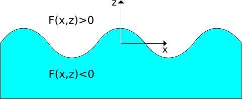{fig-align="center" width="700px" height="300px" style="object-fit: cover; border-radius: 10px;"}
:::
::::

## Initialisation de la vague de Stokes (suite)

:::: {.columns}

::: {.column width="25%"} 
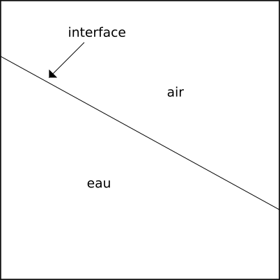{fig-align="center" height="400px"}
**Espace de départ**
:::

::: {.column width="25%"}
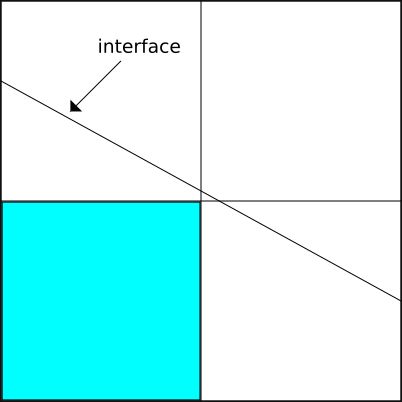{fig-align="center" height="400px"}
**Première subdivision**
:::

::: {.column width="25%"}
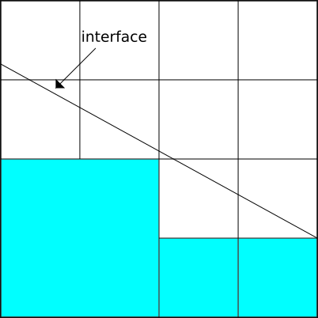{fig-align="center" height="400px"}
**Deuxième subdivision**
:::

::: {.column width="25%"}
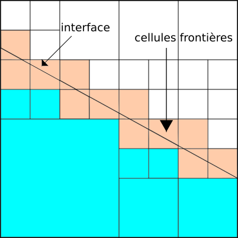{fig-align="center" height="400px"}
**Troisième subdivision**
:::

::::
- Enfin, pour ces mailles, on initialise : 

::: {.text-center}
$$C_1 = \frac{\text{aire de la maille dans l'eau}}{\text{aire totale de la maille}} = \frac{\alpha}{\Delta x \Delta z}$$
:::


## Initialisation de la vague de Stokes (suite)

- Initialisation de la vague pour $h$=10m, $a$=0.25m, $\lambda$=3.14 m

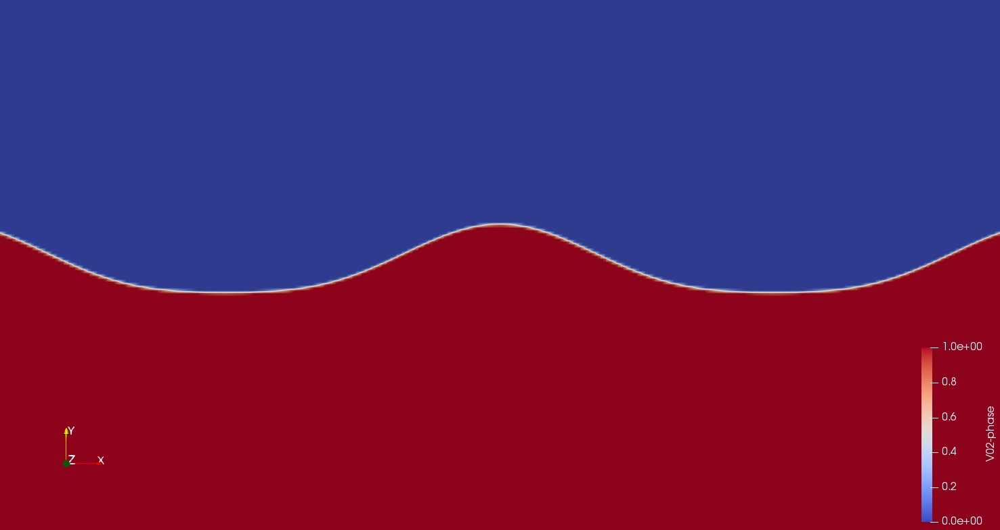{fig-align="center" style="object-fit: cover; border-radius: 10px;"}

## Initialisation de la vague de Stokes (fin)

- Pour que la vague puisse se propager dans le domaine de calcul, on doit aussi initialiser le champ de vitesse à partir de la fonction de potentiel $\Phi$ :
$$u = \frac{\partial\Phi}{\partial x} \qquad v = \frac{\partial\Phi}{\partial z}$$

- Faire attention à n'imposer la vitesse analytique de Stokes que dans l'eau, sinon cela peut créer des instabilités numériques dans l'air.

```{=html}
<div style="display: flex; justify-content: center;">
  <video autoplay loop muted playsinline width="1000">
    <source src="videos/vague_3eme_grand.mp4" type="video/mp4">
  </video>
</div>
``` 
---

## Résultats préliminaires

```{=html}
<div style="display: flex; gap: 1.5rem; align-items: flex-start;">
  <div style="flex: 1; text-align: center;">
    <video autoplay loop muted playsinline width="55%">
      <source src="videos/interface_100.mp4" type="video/mp4">
    </video>
    <p style="font-size: 0.9em;">μ<sub>solide</sub> = 100</p>
  </div>
  <div style="flex: 1; text-align: center;">
    <video autoplay loop muted playsinline width="55%">
      <source src="videos/interface_solide.mp4" type="video/mp4">
    </video>
    <p style="font-size: 0.9em;">μ<sub>solide</sub> = 1000</p>
  </div>
  <div style="flex: 1; text-align: center;">
    <video autoplay loop muted playsinline width="55%">
      <source src="videos/vague_solide.mp4" type="video/mp4">
    </video>
    <p style="font-size: 0.9em;">Ajout d'une vague de Stokes</p>
  </div>
</div>
```

## Références


