## Contexte

- Production accrue de plastiques depuis les années 1950
- Pollution marine majeure : 4-12 millions de tonnes de plastique/an   
- Danger pour la faune et les écosystèmes marins

::: {layout-ncol=2}


:::
```{=html}
<div style="text-align: center; font-size: 0.7em;">
Source : The Ocean Cleanup
</div>
```

---

## Objectifs

<!-- Objectif final --> 
- Prédire le mouvement et la dispersion des plastiques dans les océans
<!-- Pour atteindre cet objectif on a besoin de ... --> 
- Modéliser la dynamique des plastiques à l'aide de simulations numériques
- Comprendre la dynamique des plastiques en interaction avec les vagues (Dérive de Stokes)

{fig-align="center" width="800px" height="450px" style="object-fit: cover; border-radius: 10px;"}

<div style="text-align: center; font-size: 0.7em;">
By <a href="//commons.wikimedia.org/wiki/User:Kraaiennest" title="User:Kraaiennest">Kraaiennest</a> - <a href="https://creativecommons.org/licenses/by-sa/4.0" title="Creative Commons Attribution-Share Alike 4.0">CC BY-SA 4.0</a>, <a href="https://commons.wikimedia.org/w/index.php?curid=3374567">Link</a>
</div>

## Découpage du problème en 4 sous problèmes

<br>

```{=html}
<div style="display: flex; gap: 1.5rem; align-items: flex-start;">
  
  <div style="flex: 1; text-align: center;">
    <p style="margin-bottom: 5px;"><strong>Diphasique</strong></p>
    <video autoplay loop muted playsinline width="62%">
      <source src="videos/solide.mp4" type="video/mp4">
    </video>
    <p style="font-size: 0.9em;">Solide seul (eau / solide)</p>
  </div>
  
  <div style="flex: 1; text-align: center;">
    <p style="margin-bottom: 5px;"><strong>Triphasique</strong></p>
    <video autoplay loop muted playsinline width="62%">
      <source src="videos/cylindre_2.mp4" type="video/mp4">
    </video>
    <p style="font-size: 0.9em;">Ajout d'une interface plane air / eau / solide</p>
  </div>
  
  <div style="flex: 1; text-align: center;">
    <p style="margin-bottom: 5px;"><strong>Diphasique</strong></p>
    <video autoplay loop muted playsinline width="62%">
      <source src="videos/vague3emeordre.mp4" type="video/mp4">
    </video>
    <p style="font-size: 0.9em;">Ajout d'une vague de Stokes (eau / air)</p>
  </div>
  
  <div style="flex: 1; text-align: center;">
    <p style="margin-bottom: 5px;"><strong>Triphasique</strong></p>
    <video autoplay loop muted playsinline width="62%">
      <source src="videos/out3.mp4" type="video/mp4">
    </video>
    <p style="font-size: 0.9em;">Ajout d'une particule sur la vague</p>
  </div>
  
</div>
```

## Equations régissant la dynamique du problème en présence de particule
- Dans le domaine $\Omega_{\text{tot}}= \Omega_f \cup \Omega_p$, on résout les équations de Navier-Stokes incompressible, tout en imposant un mouvement de **corps rigide** dans la **région occupée par le solide** $\Omega_p$.
$$
\nabla\cdot \mathbf{u} =0 \quad \forall \mathbf{x} \in \Omega_{\text{tot}}$$
$$
{\color{red}{\rho_{\text{eff}}}} \left( \frac{\partial \mathbf{u}}{\partial t} + \mathbf{u} \cdot \nabla \mathbf{u} \right) = -\nabla p + \nabla \cdot \left[ {\color{red}{\mu_{\text{eff}}}} (\nabla \mathbf{u} + \left(\nabla \mathbf{u}\right)^T) \right] + {\color{red}{\rho_{\text{eff}}}} \mathbf{g} \quad \forall \mathbf{x} \in \Omega_{\text{tot}}
$$
$$
\mathbf{u} = \mathbf{U} + \boldsymbol{\omega} \times \mathbf{OM} \quad \forall \mathbf{x} \in \Omega_p
$$

- On transporte deux champs de fraction volumique : $C_1$ pour l'eau, et $C_2$ pour le solide. 

$$ \frac{\partial C_1}{\partial t} + \mathbf{u} \cdot \nabla C_1 = 0 \qquad \frac{\partial C_2}{\partial t} + \mathbf{u} \cdot \nabla C_2 = 0
$$


## Modélisation des phases 

- On utilise une formulation dite **1 fluide** pour modéliser les différentes phases.

- On introduit deux fonctions de couleur $C_1$ et $C_2$ :

::: {.text-center}
$$
C_1 = 
  \begin{cases}
 1 & \text{dans l'eau} \\
 0 & \text{ailleurs}
  \end{cases} 
\qquad \text{et}\qquad
C_2 = 
  \begin{cases}
 1 & \text{dans le solide} \\
 0 & \text{ailleurs}
 \end{cases}
$$
:::

:::: {.columns}

::: {.column width="25%"}
{height=350px fig-align="center"}

:::

::: {.column width="25%"}
{height=350px fig-align="center"}

:::

::: {.column width="25%"}
{height=350px fig-align="center"}

:::

::: {.column width="25%"}
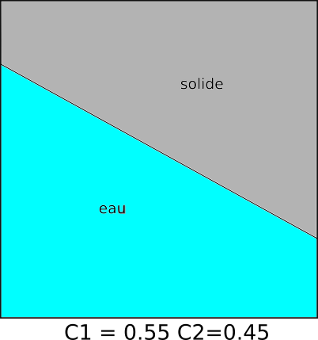{height=350px fig-align="center"}

:::

::::


## Lois de mélange des propriétés physiques

**Loi arithmétique pour la densité effective :**
$$
{\color{red}{\rho_{\text{eff}}}} = (1-C_1-C_2)\rho_{\text{air}} + C_1 \rho_{\text{eau}} + C_2 \rho_{\text{solide}}
$$

**Plusieurs lois de mélange testés pour la viscosité effective : **

<br>

**Loi arithmétique :**
$$
{\color{red}{\mu_{\text{eff}}}} = (1-C_1-C_2)\mu_{\text{air}} + C_1 \mu_{\text{eau}} + C_2 \mu_{\text{solide}}
$$

**Loi harmonique :**
$$
{\color{red}{\mu_{\text{eff}}}} = \frac{\mu_{\text{air}} \mu_{\text{eau}} \mu_{solide}}{(1-C_1-C_2)\mu_{\text{eau}} \mu_{\text{solide}} + C_1 \mu_{\text{air}}\mu_{\text{solide}} + C_2 \mu_{\text{air}} \mu_{\text{eau}}}
$$
**Loi géométrique :**
$$
{\color{red}{\mu_{\text{eff}}}} = \mu_{\text{air}}^{(1-C_1-C_2)}  \mu_{\text{eau}}^{C_1}  \mu_{\text{solide}}^{C_2}
$$


## Mouvement de corps rigide : pénalisation tensorielle

- **Idée** : imposer un mouvement de **corps rigide** dans la région occupée par le solide où ${\color{blue}{C_2=1}}$ et ${\color{blue}{C_1=0}}$.  
  (Dans la région solide, ${\color{red}{\rho_{\text{eff}}}} = {\color{blue}{\rho_{\text{solide}}}}$ et ${\color{red}{\mu_{\text{eff}}}}={\color{blue}{\mu_{\text{solide}}}}$)

$$
{\color{blue}{\rho_{\text{solide}}}} \left( \frac{\partial \mathbf{u}}{\partial t} + \mathbf{u} \cdot \nabla \mathbf{u} \right) = -\nabla p + \nabla \cdot \left[ {\color{blue}{\mu_{\text{solide}}}} (\nabla \mathbf{u} + (\nabla \mathbf{u})^T) \right] + {\color{blue}{\rho_{\text{solide}}}} \mathbf{g}
$$

- Si on fait tendre la viscosité du solide vers l'infini ($\mu_{\text{solide}} \to \infty$), cela revient à résoudre dans le solide :

$$\nabla \cdot [{\color{blue}{\mu_{\text{solide}}}} (\nabla \mathbf{u} + \left(\nabla \mathbf{u}\right)^T)]=0$$

- On peut montrer que c'est équivalent à imposer ( @patankar2000, @sharma2005) : 

$$
{\color{blue}{\mu_{\text{solide}}}} (\nabla \mathbf{u} + (\nabla \mathbf{u})^T) = \mathbf{0} \quad \text{lorsque} \quad {\color{blue}{\mu_{\text{solide}}}} (\nabla \mathbf{u} + (\nabla \mathbf{u})^T) \cdot \mathbf{n} = \mathbf{0} \quad \forall x\in \partial \Omega_p
$$

- Ce qui est équivalent à imposer un mouvement de corps rigide (@CALTAGIRONE2001607, @vincent2007) :

$$
\mathbf{u} = \mathbf{U} + \boldsymbol{\omega} \times \mathbf{OM} 
$$

## Code utilisé : Fugu

::: {.columns style="display: flex; align-items: center;"}

::: {.column width="60%"}
Développé par le **laboratoire MSME**, Fugu est un solveur basé sur la méthode des volumes finis.

**Caractéristiques techniques :**

* **Architecture :** Code écrit en **Fortran** et parallélisé avec **MPI** pour le calcul haute performance (HPC).
* **Résolution de l'écoulement :** Résolution des équations de Navier-Stokes avec une flexibilité sur le traitement de la turbulence (LES, DNS).
* **Méthodes spécifiques :** 
  * Suivi d'interface pour les écoulements multiphasiques (**VOF** - Volume of Fluid).
  * Modélisation des obstacles par la méthode de **pénalisation tensorielle** (corps solides).
* **Application cible :** Étude des interactions houle-structure et de la dynamique des particules.
:::

::: {.column width="40%"}
{width="70%" fig-align="center"}
:::

:::

## Algorithme de résolution au sein d'un pas de temps $\Delta t$:

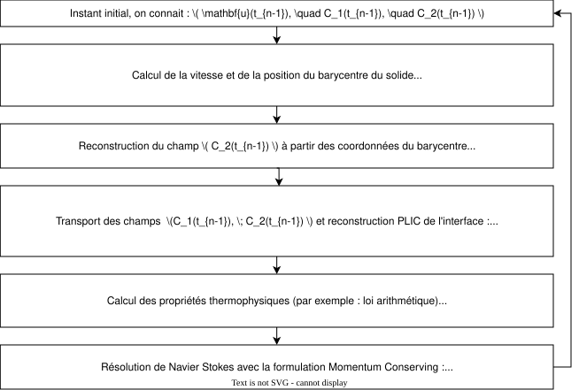{fig-align="center"}


## Formulation Momentum Conserving (@ELOUAFA2026)

1. **Interpolation** : La densité $\rho_{\text{eff}}$ (obtenue par la VOF) est interpolée vers les faces des cellules. On obtient la densité exacte sur la grille décalée, notée $\rho_{\text{eff}}^n$.
2. **Synchronisation initiale** : Calcul de la quantité de mouvement aux faces $(\rho_{\text{eff}} \mathbf{u})^n$.
3. **Transport prédictif** : Transport de la masse et de la quantité de mouvement pour obtenir les champs prédictifs $\rho_{\text{eff}} ^\star$ et $(\rho_{\text{eff}} \textbf{u})^\star$ (via un intégrateur temporel très stable de type SSP-RK3) : 
$$
\frac{\partial \rho_{\text{eff}} ^\star}{\partial t} + \nabla \cdot (\rho_{\text{eff}} ^\star \mathbf{u}) =0 \qquad (\text{On résout pour} \; \mathbf{\rho_{\text{eff}} ^\star})
$$
$$
\frac{\partial (\rho_{\text{eff}} \mathbf{u})^\star}{\partial t} + \nabla \cdot ((\rho_{\text{eff}} \mathbf{u})^\star \otimes \mathbf{u}) = \mathbf{0} \qquad (\text{On résout pour} \; \mathbf{(\rho_{\text{eff}} \mathbf{u})^\star})
$$

4. **Résolution de la physique** : Insertion de $\rho_{\text{eff}} ^\star$ et $(\rho_{\text{eff}} \textbf{u})^\star$ dans le terme inertiel de Navier-Stokes. Le système de type Stokes résout ensuite la vraie vitesse $\mathbf{u}^{n+1}$ et la pression $p^{n+1}$ :
$$
\frac{\rho_{\text{eff}}^\star \mathbf{u}^{n+1} - (\rho_{\text{eff}}\mathbf{u})^\star}{\Delta t} = - \nabla p^{n+1} + \nabla \cdot [\mu_{\text{eff}}(\nabla \mathbf{u}^{n+1} + (\nabla \mathbf{u}^{n+1})^T)] + \rho_{\text{eff}}^\star \mathbf{g}
$$
$$
\nabla \cdot \mathbf{u}^{n+1} = 0
$$ 


<div style="text-align:center; margin-top:2vh;">

# Etude de l'ascension d'un cylindre 2D

</div>


## Cylindre 2D léger en ascension dans un fluide

On étudie les travaux de @article en 2D

:::: {.columns}
::: {.column width="33%"}

<div style="text-align: center;">
**Nombres adimensionnels du problème** :
</div>

$$\color{black}{
\Pi_1 = \frac{\rho_{\text{solide}}}{\rho_{\text{fluide}}}=m}
$$
$$\color{black}{
\Pi_2=\frac{U}{\sqrt{Dg}}=F_r}
$$
$$\color{black}{
\Pi_3=\frac{\sqrt{(1-m)gD^3}}{\nu_f}=G_a}
$$

:::

::: {.column width="33%"}
{fig-align="center" height="600px"}
:::

::: {.column width="33%"}
```{=html}
<div style="flex: 1; text-align: center;">
    <video autoplay loop muted playsinline style="width: 100%; max-width: 225px;">
      <source src="videos/solide.mp4" type="video/mp4">
    </video>
</div>
```
<div style="text-align: center; font-size: 0.9em;">
**Simulation pour $m=0.8, G_a=16$**
</div>

:::

::::

- Parois solides avec **condition d'adhérence** (vitesse nulle), sauf pour paroi supérieure (**condition de symétrie**).

- En fixant $m=0.8$ et $G_a=16$, on peut retrouver l'inconnu du problème : 
$\mathbf{U=\sqrt{Dg} \; f(Fr)}$.

- $\mu_\text{solide}$ fixée à 1000. Loi de mélange arithmétique pour $\mu_\text{eff}$.

## Etude de convergence en maillage

Variable d'étude : **vitesse verticale finale** du barycentre du cylindre. Extrapolation de Richardson pour obtenir la valeur de référence.

::: {style="font-size: 80%;"}

| Maillage | $N_x$ | $N_y$ | $\Delta x = \Delta y$ | Mailles / diamètre | 
|:---:|:---:|:---:|:---:|:---:|
| 1 | 48  | 120  | 0.167   | 6 | 
| 2 | 96 | 240  | 0.083   | 12 | 
| 3 | 192 | 480  | 0.042  | 24 | 

: Caractéristiques des différents maillages testés {#tbl-mesh_properties}

:::

```{=html}
<div style="display: flex; justify-content: center; gap: 20px;">
  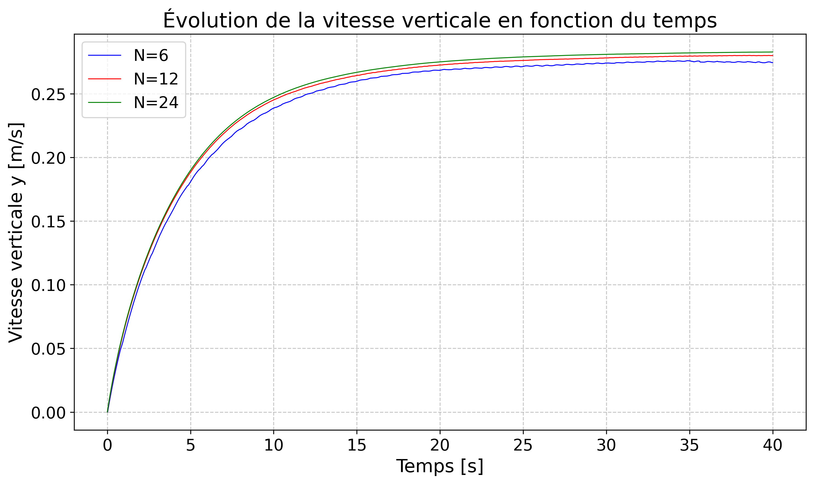
  
</div>
```


<div style="text-align:center; margin-top:2vh;">

# Validation du solveur FSI multiphasique : Etude du mouvement transitoire d'un cylindre flottant 

</div>

## Expérience de laboratoire de référence (@Ito1977)

:::: {.columns}
::: {.column width="50%"}
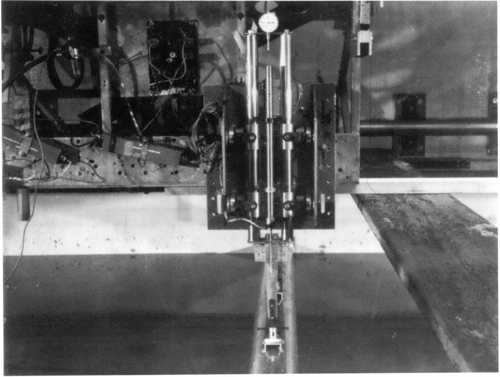{fig-align="center" height="500px"}
:::
::: {.column width="50%"}
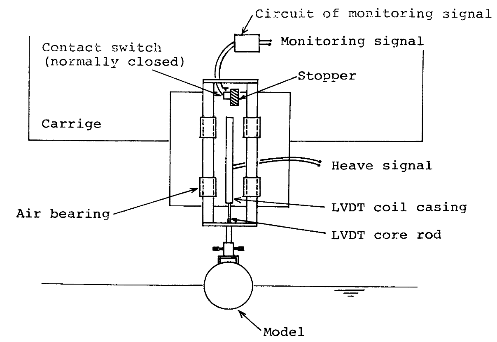{fig-align="center" height="500px"}
:::
::::

:::: {.columns}
::: {.column width="50%"}
| Paramètre | Valeur |
|:---------|:------:|
| Diamètre du cylindre (D)| 0.1524 m |
| **Longueur** du bassin| 27.432 m **(180 D)** |
| **Largeur** du bassin | 2.5908 m **(17 D)** |
| Hauteur du bassin | 1.22 m |
| Position initiale p/r à l'interface | 0.0254 m **(0.16 D)**  |

: Caractéristiques du bassin de l'expérience {#tbl-tank_properties}
:::
::: {.column width="50%"}
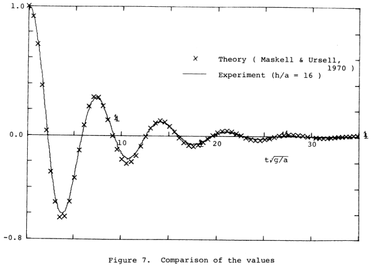{fig-align="center" height="450px"}
:::
::::

## Référence théorique (@Maskell_Ursell_1970)

- Solution théorique en écoulement **potentiel**, incompressible, et ignore la tension de surface.

$$
\small
\text{Solution théorique complète:} \quad
h_2(\tau) = -\frac{1}{\pi i} \int_{-\infty}^{\infty} \frac{u(1+A(u)) e^{-iu\tau}}{1 - \frac{1}{2}\pi u^2(1+A(u))} du \qquad \text{avec} \qquad \tau = t\sqrt{\frac{2g}{D}}
$$

$$
\small
\text{Solution théorique approximée:} \quad
h_{2\text{approx}}(\tau) = 0.9664 \text{exp}(-0.1309\tau)\times \text{cos}\left(0.9117\tau - 0.4805\right)
$$

:::: {.columns}
::: {.column width="50%"}
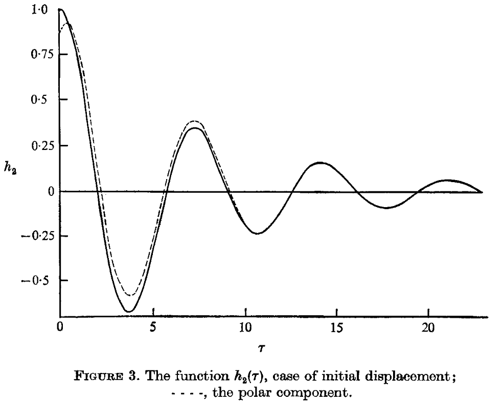{fig-align="center" width=800px}
:::
::: {.column width="50%"}

```{=html}
<div style="flex: 1; text-align: center;">
    <video autoplay loop muted playsinline style="width: 100%; max-width: 800px;">
      <source src="videos/oscillation.mp4" type="video/mp4">
    </video>
</div>
```
:::
::::

## Modélisation Numérique (@Soydan2025)

:::: {.columns}
::: {.column width="50%"}
{fig-align="center"}


- Parois solides avec **condition d'adhérence** sauf pour paroi supérieure (**condition de symétrie**)

- On trace l'oscillation du barycentre du cylindre adimensionné par le déplacement initial $h_1$ :

$$
h_2(t)=\frac{y_G(t)-d}{h_1}
$$

:::
::: {.column width="50%"}
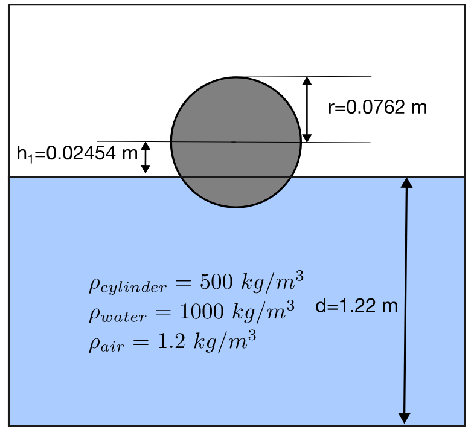{fig-align="center" height="600px"}

<div style="height:100%; display:flex; align-items:center; justify-content:center;">
**Théorie des ondes (validité des résultats)** :
</div>

$$
c=\sqrt{gd} = 3.46 \; \text{m/s}
$$
$$
t_{valide}=\frac{L}{\sqrt{gd}}=\frac{32.80D}{\sqrt{gd}} = 1.44 \; s
$$

:::
::::

## Etude paramétrique du problème 

::: {style="display: flex; justify-content: center; align-items: center; height: 100%;"}
::: {style="text-align: left;"}
**4 paramètres à étudier :**

1. **Loi de mélange de la viscosité effective** : (arithmétique, harmonique, géométrique)
2. **Critère de convergence du solveur (résidu à atteindre)**
3. **Valeur de la viscosité pénalisante $\mu_\text{solide}$**
4. **Résolution du maillage** (nombre de mailles par diamètre du cylindre)
:::
:::


## Influence de la loi de mélange de la viscosité 

:::: {.columns}
::: {.column width="50%"}
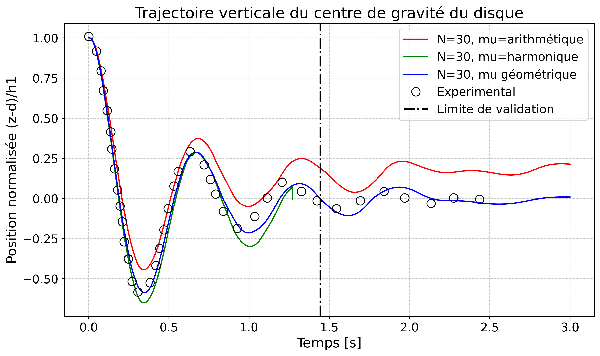{fig-align="center" height="600px"}
:::
::: {.column width="50%"}
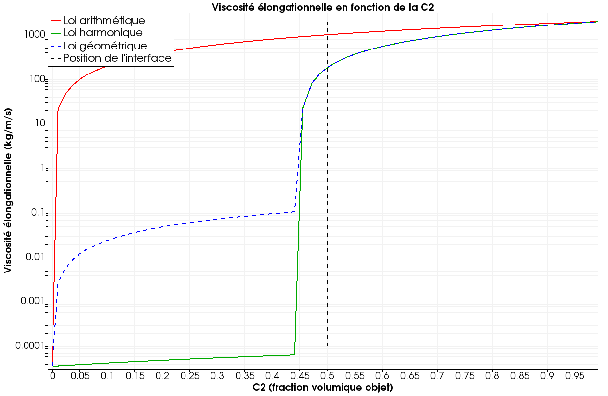{fig-align="center" height="600px"}
:::
::::


$$
{\color{black}{\mu_{\text{arithmétique}}}} = (1-C_1-C_2)\mu_{\text{air}} + C_1 \mu_{\text{eau}} + C_2 \mu_{\text{solide}}
$$


$$
{\color{black}{\mu_{\text{harmonique}}}} = \frac{\mu_{\text{air}} \mu_{\text{eau}} \mu_{solide}}{(1-C_1-C_2)\mu_{\text{eau}} \mu_{\text{solide}} + C_1 \mu_{\text{air}}\mu_{\text{solide}} + C_2 \mu_{\text{air}} \mu_{\text{eau}}}
$$

$$
{\color{black}{\mu_{\text{géométrique}}}} = \mu_{\text{air}}^{(1-C_1-C_2)}  \mu_{\text{eau}}^{C_1}  \mu_{\text{solide}}^{C_2}
$$


## Influence du critère de convergence du solveur 

Simulation pour N=30, $\Delta t = 5 \times 10^{-4}$, $\mu_{\text{solide}} = 1000 \; kg/m/s$

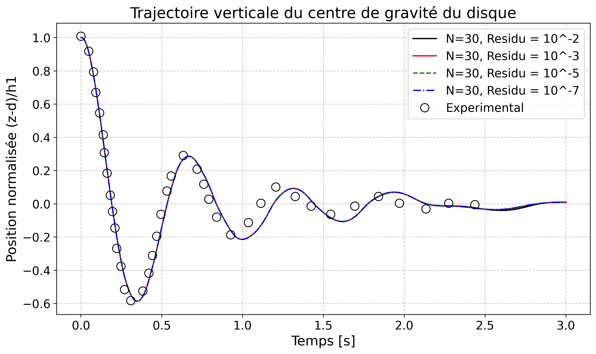{fig-align="center"}


## Influence de la viscosité pénalisante $\mu_\text{solide}$

Simulation pour N=30, $\Delta t = 5 \times 10^{-4}$, résidu à atteindre : $10^{-7}$

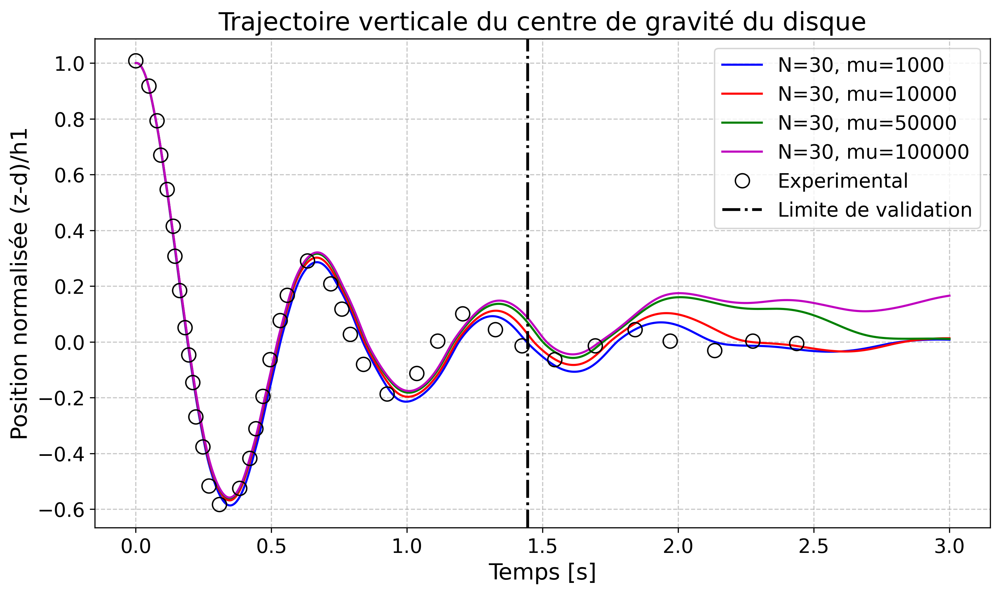{fig-align="center"}


## Etude de convergence en maillage

Simulation pour $\mu_{\text{solide}} = 1000 \; kg/m/s$, résidu à atteindre : $10^{-5}$.

::: {style="font-size: 80%;"}

| Mailles/diamètre | $\Delta x = \Delta y$ | $\Delta t$ |
|:---------:|:---------:|:------:|
| 30 | $5 \times 10^{-3}$ | $5 \times 10^{-4}$ | 
| 45 | $3,39 \times 10^{-3}$ | $3 \times 10^{-4}$ |
| 60 | $2,5 \times 10^{-3}$ | $2,5 \times 10^{-4}$ | 

:::

:::: {.columns}
::: {.column width="50%"}
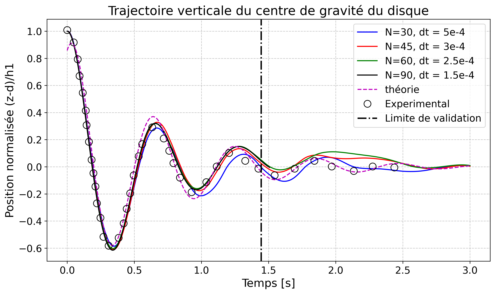{fig-align="center" width="100%" .column-page}
:::
::: {.column width="50%"}
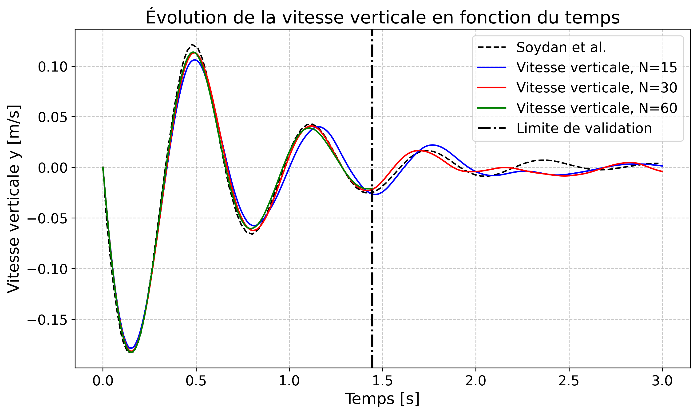{fig-align="center" width="100%" .column-page}
:::
::::

## Etude de convergence de maillage (suite)
$$
\scriptsize
\text{Erreur : } \alpha = \vert h_{2\text{approx}}-h_{2\text{num}}\vert \qquad \text{Norme } L_p \text{ de l'erreur } \alpha : \Vert \alpha \Vert_p = \left( \frac{1}{t_{\text{valide}}}\int_0^{t_{\text{valide}}} \alpha (t)^p\,dt \right)^{\frac{1}{p}} \qquad \text{Norme } L_\infty \text{ de l'erreur } : \Vert \alpha \Vert_\infty = \text{sup}(\alpha)
$$

$$
\scriptsize
\text{On trace :} \frac{\Vert \alpha \Vert_1}{\Vert h_{2\text{ref}} \Vert_1}, \; \frac{\Vert \alpha \Vert_2}{\Vert h_{2\text{ref}} \Vert_2}   \; \text{et} \; \frac{\Vert \alpha \Vert_\infty}{\Vert h_{2\text{ref}} \Vert_\infty} \text{ en fonction de } \Delta x \; \text{pour} \; t \in [0.02,t_{\text{valide}}]
$$

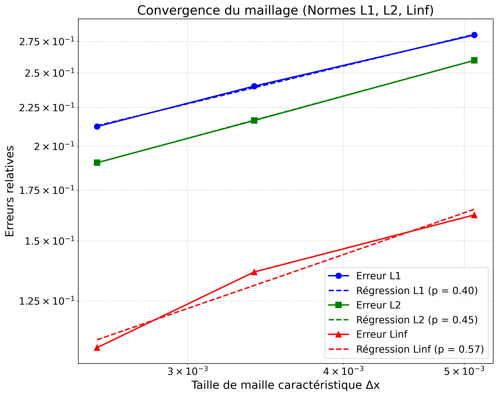{fig-align="center" width="100%"}


<div style="text-align:center; margin-top:2vh;">

# Ajout d'une vague de Stokes
```{=html}
<div style="display: flex; justify-content: center;">
  <video autoplay loop muted playsinline width="1200">
    <source src="videos/vague_3eme_grand.mp4" type="video/mp4">
  </video>
</div>
``` 

</div>


## Initialisation de la vague de Stokes (@Fenton1985)

- Nous utilisons la formulation de la vague de Stokes du **troisième ordre** pour une **profondeur $h$** quelconque : 

:::: {.columns}
::: {.column width="50%"}
$$
\small
\begin{aligned}
\eta(x,t)
&=
a\cos(\theta)
\\
&+
\frac14
\alpha
(3\alpha^2-1)
a^2k
\cos(2\theta)
\\
&-
\frac38
(\alpha^4-3\alpha^2+3)
a^3k^2
\cos(\theta)
\\
&+
\frac{3}{64}
\left(
8\alpha^6+(\alpha^2-1)^2
\right)
a^3k^2
\cos(3\theta)
\end{aligned}
$$

:::
::: {.column width="50%"}
$$
\small
\alpha = \coth(kh)
$$

$$
\small
\theta(x,t) = kx - \omega t
$$

$$
\small
\omega^2
=
gk\tanh(kh)
\left[
1+(ka)^2
\left(
\alpha^2+\frac{9}{8}(\alpha^2-1)^2
\right)
\right]
$$
:::
::::

{fig-align="center" height="300px"}

( By <a href="//commons.wikimedia.org/wiki/User:Kraaiennest" title="User:Kraaiennest">Kraaiennest</a> <a href="https://creativecommons.org/licenses/by-sa/3.0" title="Creative Commons Attribution-Share Alike 3.0">CC BY-SA 3.0</a>, <a href="https://commons.wikimedia.org/w/index.php?curid=18263067">Link</a>)

## Initialisation de la vague de Stokes (suite)

- On veut imposer au temps $t=0$ :
$$
C_1 = 
  \begin{cases}
 1 & \text{dans l'eau} \\
 0 & \text{dans l'air}
  \end{cases} 
$$
connaissant l'expression de la surface libre $\eta(x,t)$. 

- On choisit de travailler avec $F(x,z) = z - \eta(x,t=0)$, qui est négatif dans l'eau et positif dans l'air.

:::: {.columns}
::: {.column width="50%"}
$$
F(x,z)=\begin{cases}
 < 0 & \text{dans l'eau} \\
 > 0 & \text{dans l'air} \\
 = 0 & \text{sur la surface libre}
 \end{cases}
$$
:::
::: {.column width="50%"}
{fig-align="center" width="700px" height="300px" style="object-fit: cover; border-radius: 10px;"}
:::
::::

## Initialisation de la vague de Stokes (suite)

:::: {.columns}

::: {.column width="25%"} 
{fig-align="center" height="400px"}
**Espace de départ**
:::

::: {.column width="25%"}
{fig-align="center" height="400px"}
**Première subdivision**
:::

::: {.column width="25%"}
{fig-align="center" height="400px"}
**Deuxième subdivision**
:::

::: {.column width="25%"}
{fig-align="center" height="400px"}
**Troisième subdivision**
:::

::::
- Enfin, pour la maille interfaciale, on initialise : 

::: {.text-center}
$$C_1 = \frac{\text{surface totale eau}}{\text{aire totale de la maille}}=\frac{\text{somme des aires bleues d'eau}}{\Delta x \Delta y}$$
:::


## Initialisation de la vague de Stokes (fin)

- Pour que la vague puisse se propager dans le domaine de calcul, on doit aussi initialiser le champ de vitesse (avec $A=\frac{ag}{\omega}$) (voir @Fenton1985): 

:::: {.columns}
::: {.column width="50%"}
$$
\scriptsize
\begin{aligned}
u_x(x,y,t)
&=
A
\frac{\cosh(k(y+h))}{\cosh(kh)}
k\cos(\theta)
\\
&+
\frac34
\frac{a^2gk^2}{\omega}
\frac{(\alpha^2-1)^2}{\alpha}
\frac{\cosh(2k(y+h))}{\cosh(2kh)}
\cos(2\theta)
\\
&+
\frac{3}{64}
\frac{a^3gk^4}{\omega}
(\alpha^2-1)
(\alpha^2+3)
(9\alpha^2-13)
\frac{\cosh(3k(y+h))}{\cosh(3kh)}
\cos(3\theta)
\end{aligned}
$$
:::
::: {.column width="50%"}
$$
\scriptsize
\begin{aligned}
u_y(x,y,t)
&=
A
\frac{\sinh(k(y+h))}{\cosh(kh)}
k\sin(\theta)
\\
&+
\frac34
\frac{a^2gk^2}{\omega}
\frac{(\alpha^2-1)^2}{\alpha}
\frac{\sinh(2k(y+h))}{\cosh(2kh)}
\sin(2\theta)
\\
&+
\frac{3}{64}
\frac{a^3gk^4}{\omega}
(\alpha^2-1)
(\alpha^2+3)
(9\alpha^2-13)
\frac{\sinh(3k(y+h))}{\cosh(3kh)}
\sin(3\theta)
\end{aligned}
$$
:::
::::

- Exemple de vague simulée pour : $h$=1 m, $a$=0.04 m, $\lambda$=1 m : 

```{=html}
<div style="display: flex; justify-content: center;">
  <video autoplay loop muted playsinline width="650">
    <source src="videos/out.mp4" type="video/mp4">
  </video>
</div>
``` 
---

## Validation de la forme de la vague

- On travaille avec : $a = 0.04 \; \text{m}$, $h = 1 \; \text{m}$, $\lambda = 1 \; \text{m}$ ($k = 2\pi \; m^{-1}$) pour s'assurer que la vague ne se brise pas (critère de Stokes : déferlement quand $ka \geq 0.446$, dans notre cas : $ka \approx 0.25$)

- Validation de la vague simulée par comparaison au profil théorique après T périodes de simulation, avec $T= \frac{2\pi}{\omega} = \frac{2\pi}{\sqrt{gk\tanh(kh)\left[1+(ka)^2\left(\alpha^2+\frac{9}{8}(\alpha^2-1)^2\right)\right]}}$

:::: {.columns}
::: {.column width="50%"}
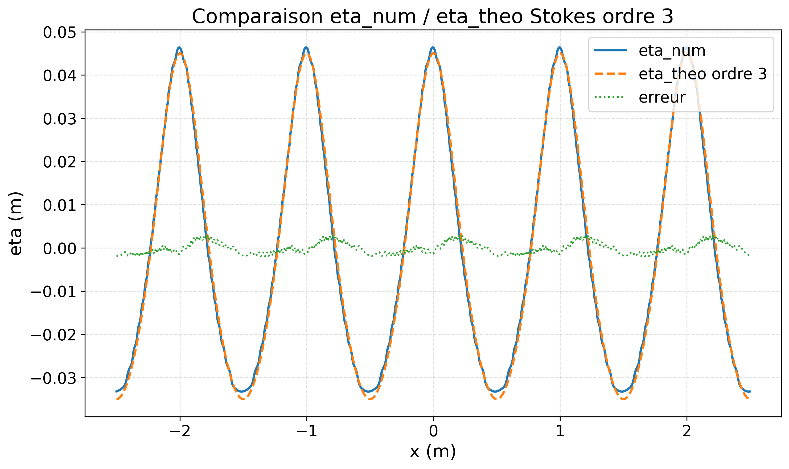{fig-align="center" width="100%"}
<div style="height:100%; display:flex; align-items:center; justify-content:center;">
Comparaison après T=3 périodes
</div>

:::
::: {.column width="50%"}
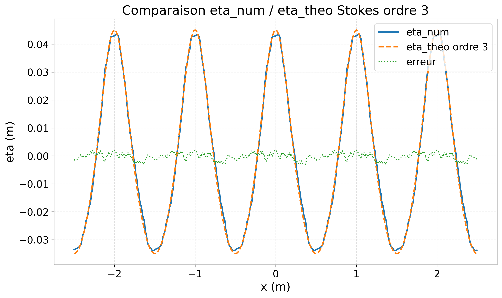{fig-align="center" width="100%"}
<div style="height:100%; display:flex; align-items:center; justify-content:center;">
Comparaison après T=10 périodes
</div>
:::
::::

## Etude de convergence en maillage après 3 périodes de vague

Mailles/Hauteur de vague| $\Delta x = \Delta y$ | $\Delta t$ | Erreur relative $L_{1}$| Erreur relative $L_{2}$| Erreur relative $L_{\infty}$ |
|:---------:|:---------:|:------:|:------:|:------:|:------:|
|8 |  $1 \times 10^{-2}$ | $2 \times 10^{-3}$  | 10.5% |11% |14% |
| 16 | $5 \times 10^{-3}$ | $1 \times 10^{-3}$| 4.6%|4.8% | 6.5% |
| 32 | $2,5 \times 10^{-3}$ | $5 \times 10^{-4}$ | 2.27%  | 2.4% | 3.15% |

: Erreurs relatives en fonction du maillage 

:::: {.columns}
::: {.column width="33%"}
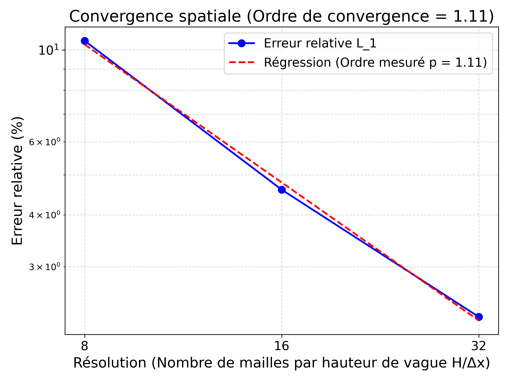{fig-align="center"}
<div style="height:100%; display:flex; align-items:center; justify-content:center;">
Erreur $L_{1}$
</div>

:::

::: {.column width="33%"}
{fig-align="center"}
<div style="height:100%; display:flex; align-items:center; justify-content:center;">
Erreur $L_2$
</div>

:::
::: {.column width="33%"}
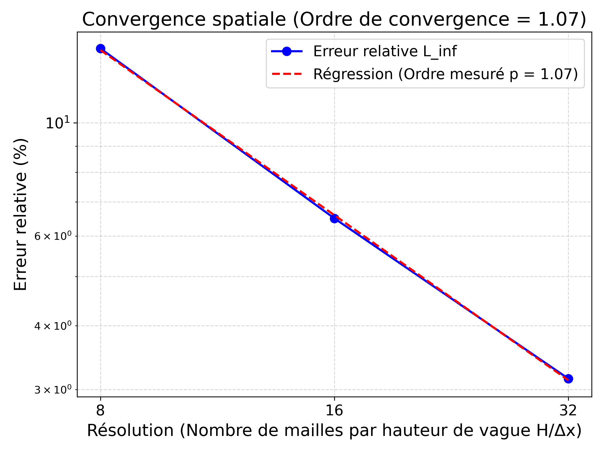{fig-align="center"}
<div style="height:100%; display:flex; align-items:center; justify-content:center;">
Erreur $L_{\infty}$
</div>
:::
::::

## Bilan et perspectives

**Perspectives :**

- Faire une validation après 50 / 100 périodes de vague pour vérifier la stabilité du solveur.

- Validation du profil de vitesse dans l'eau à la théorie.


**Dans la suite :** 

- Loi géométrique pour la viscosité effective.

- Maillage retenu : 32 mailles/hauteur de vague, soit 60 mailles par diamètre du cylindre ($\Delta x = 2.5 \times 10^{-3}$ m).

<div style="text-align:center; margin-top:2vh;">

# Ajout d'une particule solide sur la vague de Stokes

</div>

## Première simulation 

```{=html}
<div style="display: flex; justify-content: center;">
  <video autoplay loop muted playsinline width="1800">
    <source src="videos/out2.mp4" type="video/mp4">
  </video>
</div>
``` 
**Perspectives d'étude** 

- Comparaison des trajectoires à des résultats avec des particules sans masse.

- Comparaison de la dérive de position horizontale à la littérature.

- Evaluation des forces exercées sur la particule par la vague.


## Références